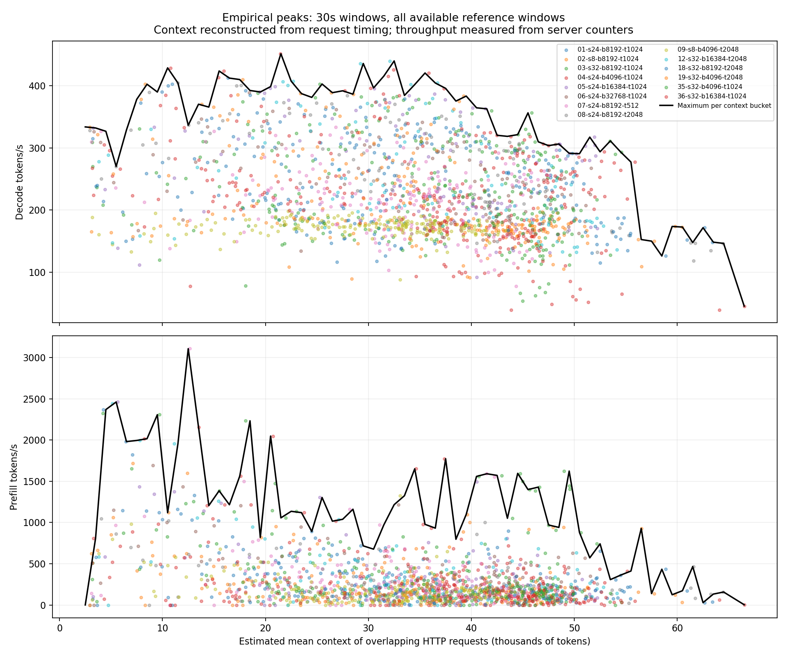

# Empirical work score

Rates are measured; context is estimated from overlapping HTTP requests, including queued requests. Output growth is assumed uniform across request lifetime. Requests without final usage/timing are excluded, so still-running calls at archival cutoff may be absent. No actual GPU context or token emission timing was recorded.

Reference: maximum observed 30-second rate in each 1000-token context bucket, pooled over completed runs (reference horizon: all available minutes). Decode and prefill use the same mean context estimate. Peaks may come from different windows. Combined score = decode/peak_decode + uncached_prefill/peak_prefill. This is an empirical index, not physical GPU utilisation; values above 1 are allowed.

Only windows with at least 95% reconstructed-context coverage and nonnegative counter deltas are scored. Missing or zero denominators give an unknown score. Scores average only covered windows; inspect valid_seconds before comparing. Sparse buckets and winners setting their own reference remain visible in peaks.csv. Reference changes when the source cohort changes. Lines connect occupied bucket centres for display; scoring uses the bucket maxima directly, without interpolation.

| Run | Interval | Scored seconds | Mean units/s |
|---|---|---:|---:|
| 01-s24-b8192-t1024 | 0-35m | 2070 | 1.0316 |
| 01-s24-b8192-t1024 | 30-35m | 300 | 0.9233 |
| 02-s8-b8192-t1024 | 0-35m | 2070 | 0.6652 |
| 02-s8-b8192-t1024 | 30-35m | 300 | 0.6160 |
| 03-s32-b8192-t1024 | 0-35m | 2070 | 1.1482 |
| 03-s32-b8192-t1024 | 30-35m | 300 | 0.9738 |
| 04-s24-b4096-t1024 | 0-35m | 2070 | 1.0515 |
| 04-s24-b4096-t1024 | 30-35m | 300 | 1.1405 |
| 05-s24-b16384-t1024 | 0-35m | 2070 | 1.0953 |
| 05-s24-b16384-t1024 | 30-35m | 300 | 0.9089 |
| 06-s24-b32768-t1024 | 0-35m | 2070 | 1.0477 |
| 06-s24-b32768-t1024 | 30-35m | 300 | 0.9608 |
| 07-s24-b8192-t512 | 0-35m | 2070 | 0.8721 |
| 07-s24-b8192-t512 | 30-35m | 300 | 0.7010 |
| 08-s24-b8192-t2048 | 0-35m | 2040 | 1.0336 |
| 08-s24-b8192-t2048 | 30-35m | 300 | 1.0024 |
| 09-s8-b4096-t2048 | 0-35m | 2070 | 0.6066 |
| 09-s8-b4096-t2048 | 30-35m | 300 | 0.5775 |
| 12-s32-b16384-t2048 | 0-35m | 2070 | 1.0578 |
| 12-s32-b16384-t2048 | 30-35m | 300 | 0.7502 |
| 18-s32-b8192-t2048 | 0-35m | 2070 | 1.0230 |
| 18-s32-b8192-t2048 | 30-35m | 300 | 0.9535 |
| 19-s32-b4096-t2048 | 0-35m | 2010 | 1.0116 |
| 19-s32-b4096-t2048 | 30-35m | 270 | 0.7373 |
| 35-s32-b4096-t1024 | 0-35m | 2070 | 0.9480 |
| 35-s32-b4096-t1024 | 30-35m | 300 | 0.7270 |
| 36-s32-b16384-t1024 | 0-35m | 2070 | 1.0903 |
| 36-s32-b16384-t1024 | 30-35m | 300 | 0.9703 |

Raw data: samples.csv, peaks.csv, scores.csv. Source paths, request exclusions and profiler caveats: manifest.json. No live services or campaign files were modified.
