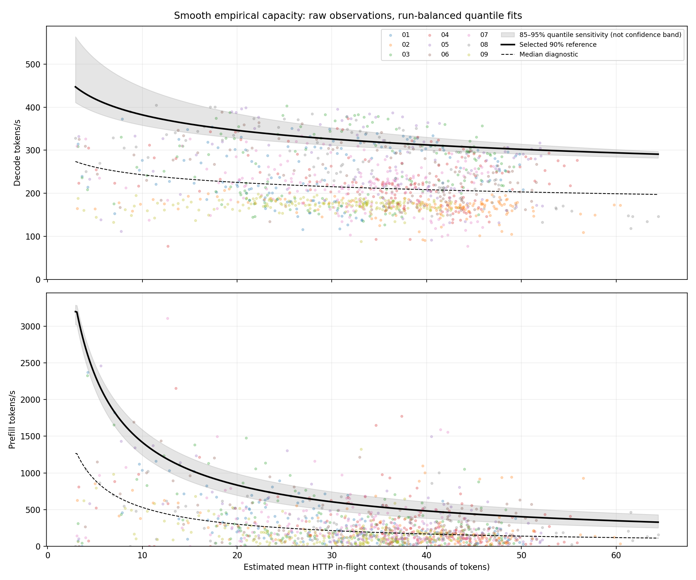

# Smooth empirical work scoring

Fits use raw 30-second observations, not bucket maxima. Reference is the 90% conditional quantile of positive throughput. Runs have equal total fitting weight. Zero-rate windows are excluded from capacity fitting but earn zero credit for that operation during scoring. All archived reference windows are used, including after tasks finish.

Candidate selection: leave one complete run out at a time; evaluate log-throughput quantile loss, averaged equally across held-out runs. Select the simplest candidate within one standard error of the lowest loss. This assesses throughput fit, not prediction of task success. The quantile is an adjustable policy choice, not physical peak capacity.

| Operation | Selected function | Lowest CV loss candidate | Held-out observations below reference |
|---|---|---|---:|
| decode | log-polynomial-1 | cubic-spline-0-knots | 89.5% |
| prefill | log-polynomial-1 | cubic-spline-4-knots | 89.3% |

## Functions

Use `WorkFunctions("path/to/functions.json")` from `fit_functions.py`. It exposes `decode_per_second(context)`, `prefill_per_second(context)`, `decode_units(context, rate)` and `prefill_units(context, rate)`. Context is tokens; rate is cluster tokens/s. Units = observed rate / fitted reference; total = decode units + prefill units. Values above one are allowed.

Exact representation: z = (log(1 + context/1000) − log_min)/(log_max − log_min); reference = exp(B(z) · coefficients). B is either a polynomial basis or cubic B-spline basis. Coefficients and knots are in functions.json. Context is clamped to each operation’s observed domain; no unsupported extrapolation.

## Minutes 30–35

| Rank | Run | Decode units/s | Prefill units/s | Combined units/s | Scored seconds |
|---:|---|---:|---:|---:|---:|
| 1 | 08-s24-b8192-t2048 | 0.856 | 0.650 | 1.506 | 300 |
| 2 | 06-s24-b32768-t1024 | 0.665 | 0.801 | 1.467 | 300 |
| 3 | 05-s24-b16384-t1024 | 0.793 | 0.626 | 1.418 | 300 |
| 4 | 03-s32-b8192-t1024 | 0.960 | 0.344 | 1.304 | 300 |
| 5 | 04-s24-b4096-t1024 | 0.848 | 0.446 | 1.294 | 300 |
| 6 | 01-s24-b8192-t1024 | 0.910 | 0.278 | 1.189 | 300 |
| 7 | 07-s24-b8192-t512 | 0.700 | 0.414 | 1.114 | 300 |
| 8 | 09-s8-b4096-t2048 | 0.536 | 0.267 | 0.803 | 300 |
| 9 | 02-s8-b8192-t1024 | 0.559 | 0.189 | 0.748 | 300 |

## First 35 minutes

| Run | Combined units/s | Scored seconds |
|---|---:|---:|
| 01-s24-b8192-t1024 | 1.312 | 2070 |
| 02-s8-b8192-t1024 | 0.859 | 2070 |
| 03-s32-b8192-t1024 | 1.507 | 2070 |
| 04-s24-b4096-t1024 | 1.343 | 2070 |
| 05-s24-b16384-t1024 | 1.447 | 2070 |
| 06-s24-b32768-t1024 | 1.396 | 2070 |
| 07-s24-b8192-t512 | 1.192 | 2070 |
| 08-s24-b8192-t2048 | 1.304 | 2070 |
| 09-s8-b4096-t2048 | 0.726 | 2070 |

## Sensitivity

0.85 reference: 06 → 08 → 05 → 04 → 03 → 01 → 07 → 09 → 02

0.95 reference: 08 → 06 → 05 → 03 → 04 → 01 → 07 → 09 → 02

## Candidate validation

| Operation | Candidate | CV loss | Standard error |
|---|---|---:|---:|
| decode | log-polynomial-1 | 0.0493 | 0.0038 |
| decode | log-polynomial-2 | 0.0483 | 0.0041 |
| decode | cubic-spline-0-knots | 0.0476 | 0.0041 |
| decode | cubic-spline-2-knots | 0.0481 | 0.0040 |
| decode | cubic-spline-4-knots | 0.0480 | 0.0040 |
| prefill | log-polynomial-1 | 0.1474 | 0.0068 |
| prefill | log-polynomial-2 | 0.1474 | 0.0069 |
| prefill | cubic-spline-0-knots | 0.1479 | 0.0066 |
| prefill | cubic-spline-2-knots | 0.1474 | 0.0067 |
| prefill | cubic-spline-4-knots | 0.1472 | 0.0068 |

Limitations inherited from source data: context is estimated from overlapping HTTP requests, including queue time and uniform output growth, not measured GPU context. Both operations share that context estimate. Calls missing final usage may be absent. Run 9 includes a profiler overrun. Initial windows lacking context coverage are unscored. Negative prefill rates smaller than 1e-6 tok/s in magnitude are floating-point subtraction noise and are clamped to zero. Sparse high-context coverage, batch occupancy and operation mix affect empirical fits. The 85–95% band shows reference-choice sensitivity, not statistical confidence. No inference services or campaign files were modified.

Audit: functions.json includes exact coefficients, validation folds and source hash; reference-curves.csv, scored-windows.csv and scores.csv provide numerical outputs.
